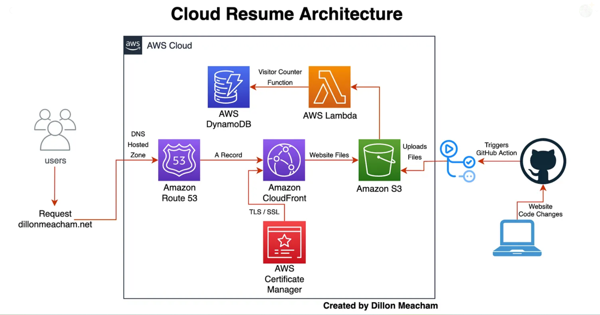

Project Overview 

This project was about transforming my resume using Amazon Web Services (AWS). I explored AWS services and modern techniques to create a Cloud Resume showcasing my skills, aiming to make an impact on potential employers. 

**AWS Services Used:**

- **Amazon S3 (Simple Storage Service):** Used for hosting files (HTML, CSS, JavaScript) due to its reliability and scalability.

- **Amazon CloudFront:** Improved website performance by distributing content globally through a Content Delivery Network (CDN).

- **AWS Certificate Manager (ACM):** Enhanced website security and user trust through HTTPS.

- **Amazon Route53:** Managed traffic routing and registered a custom domain for a professional touch.

- **AWS Lambda and Amazon DynamoDB:** Implemented a visitor counter for the website using Lambda and DynamoDB.

- **GitHub Actions:** Automated code deployment to S3 using GitHub Actions.

Techniques Implemented:

HTML for Resume Design: Utilized HTML for an engaging representation of skills and achievements.

Cloud Computing: Hosted the website on AWS for scalability and global accessibility.

Serverless Architecture: Leveraged Lambda and serverless services for simplified infrastructure management.

CI/CD Automation: Set up GitHub Actions for seamless code updates and rapid iterations.

API Integration: Integrated a visitor counter API for user engagement.

DNS Configuration: Configured Route53 for effective traffic routing and SSL certificate management.

This Cloud Resume project aimed to highlight skills through AWS and modern techniques, showcasing the potential of cloud technology in resumes.